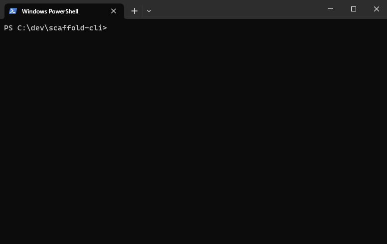

# Scaffold CLI

> A templating tool for building reusable and configurable code templates in a central place.



## How to use

Install the package

```bash
npm i -g @lukasbach/scaffold
```

You can get started by adding the official react templates to the global template scope,
and creating a react FC file:

```bash
scaf add lukasbach/scaffold-cli/templates/react
scaf react-fc "My Component Name"
```

If you want to further customize how the template works, you could 

* Provide additional parameters:
  ```bash
  scaf react-fc "My Component Name" --propsType inline --propsWithChildren false
  ```
* Require scaffold to interactively ask for *all* parameters:
  ```bash
  scaf react-fc --all
  ```
* Create an alias or redefinition of an existing template with custom config values:
  ```bash
  scaf customize react-fc -g
  scaf edit-config
  ```
  
  Adds a custom template overwrite such as:
  ```yaml 
  templates:
    react-fc:
      source: ./templates/react/react-fc
      defaults:
        componentName: My Component
        dummyProp: false
        exportPropsType: true
        importReactSymbols: false
        propsType: type
        propsWithChildren: true
        deconstructProps: true
        filenameCase: paramCase
        fileExtension: tsx
      omitActions:
        - tsFormat
      postActions:
        - eslint
  ```
  
You can not only add and redefine templates globally, but also scoped to specific projects
on your disk. Run

```bash
scaf init
```

in your project repository to create a scaffold config file and from there on customize templates
scoped to your repository.

## Available Templates

To add a template to the current scope, run `scaf add githubuser/reponame/path/to/templaterepo`. This
will add the available templates to the nearest `.scaf.yml`. You can add `--global` to add it to your user
config. 

Generally, all parameters are optional when running a parameter. Parameters below marked with `[--param]` will
use preset default values if not provided, parameters marked with `--param` will ask the user in an interactive
prompt for the intended value before evaluating the template.

You can customize the default values for any template with `scaf customize template-name [--global]`.

<!-- TEMPLATE_LIST -->
### Core Templates

The following templates are core commands which are available by default.
- [__Add Template Repo__: Add a template repository to the template scope](/template-docs/core/add.md)

  `scaf add <repo> [-g,--global] `
- [__Customize Template__: Customize the default values for a template that is available in the current scope](/template-docs/core/customize.md)

  `scaf customize <template> [-g,--global] `
- [__Edit Config__: Edit global Scaffold Config file scoped to the local user](/template-docs/core/edit-config.md)

  `scaf edit-config `
- [__Initialize__: Initialize a scaffold config on a code repository](/template-docs/core/init.md)

  `scaf init --addToReadme --defaultRepos=# `
- [__List templates__: List all available templates](/template-docs/core/list.md)

  `scaf list `
- [__Create Snapshots__: Create snapshot dumps for all scaffold templates in a template repository.](/template-docs/core/scaf-snap.md)

  `scaf scaf-snap --repo=# [--output=#] [--failOnChange] `
- [__Update templates__: Update local template repositories](/template-docs/core/update.md)

  `scaf update `


### React Templates

The following templates are available in the template scope when adding the `lukasbach/scaffold-cli/react` template repository.
- [__React Context__: A React context instance with context provider, hook and context type](/template-docs/react/react-context.md)

  `scaf react-context <ctxName> [--propsTypeSuffix=#] [--contextVariableSuffix=#] [--fileExtension=#] [--placeTypeInDedicatedFile] [--placeHookInDedicatedFile] [--placeProviderInDedicatedFile] [--exportPropsType] [--dummyProp] [--importReactSymbols] [--deconstructProps] [--propsType=#] `
- [__React FC__: React Functional Component](/template-docs/react/react-fc.md)

  `scaf react-fc <componentName> [--dummyProp] [--exportPropsType] [--importReactSymbols] [--propsType=#] [--propsWithChildren] [--deconstructProps] [--filenameCase=#] [--fileExtension=#] `
- [__React Forwarded Ref__: React Component with forwarded ref](/template-docs/react/react-forward-ref.md)

  `scaf react-forward-ref <componentName> [--elementType=#] [--innerRef=#] [--includeUseRef] [--includeUseImperativeHandle] [--dummyProp] [--exportPropsType] [--importReactSymbols] [--propsType=#] [--propsWithChildren] [--deconstructProps] [--filenameCase=#] [--fileExtension=#] `


<!-- /TEMPLATE_LIST -->

## How to develop

- `yarn` to install dependencies
- `yarn start` to run the CLI
- `yarn lint` to test and fix linter errors

To publish a new version, `npm publish --access=public` is currently used.
